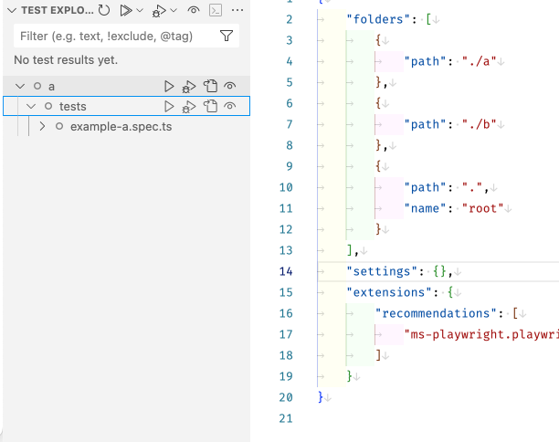
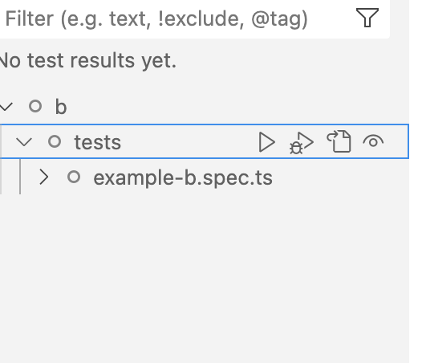

# Report playwright issues on multi-root

As you can see on the images, every time I refresh it randomly picks either one, probably whichever gets resolved first if I had to guess, since there doesn't seem to be a pattern

## Reproduce this project

Simply

1. `npm init` on both folders
2. Then install playwright `npm init playwright@latest --yes -- --quiet --browser=chromium --browser=firefox --browser=webkit --gha`
3. Create a multi-root projects with both ([report-playwright.code-workspace](report-playwright.code-workspace))
4. Go to `Testing` and see how it gets confused between `a` and `b`
# playwright-multiroot-report
